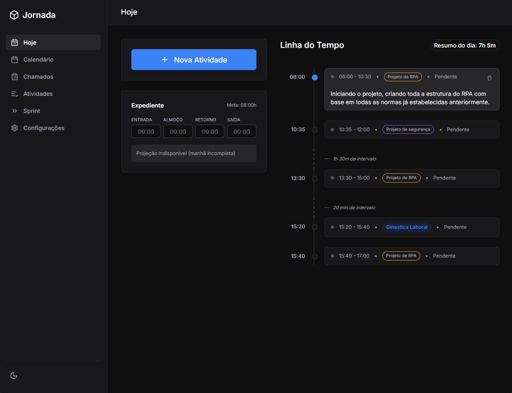
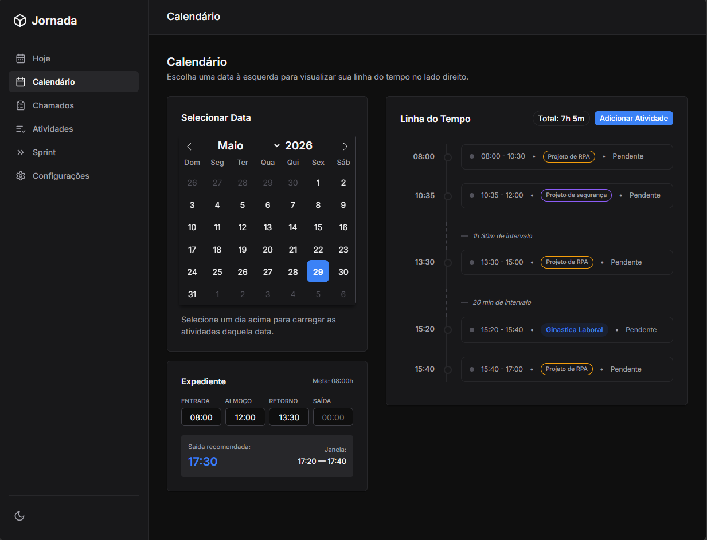

# Jornada

Aplicação local para registro de horas trabalhadas e gestão de chamados. Projeto criado para uma necessidade pessoal, para uso diário durante o expediente. Desenvolvida com FastAPI, SQLite e HTMX, a Jornada funciona inteiramente na máquina do usuário, sem dependência de serviços externos.

## Funcionalidades

- **Registro de Atividades** — Lançamento de horas com controle de início, fim e duração, vinculadas a chamados específicos
- **Gestão de Chamados** — Cadastro, categorização e acompanhamento de chamados com status personalizáveis
- **Controle de Expediente** — Registro de horários de entrada, saída, almoço e cálculo de horas trabalhadas por dia
- **Sprints** — Planejamento de sprints com editor Markdown para documentação de metas e anotações
- **Relatório de Atividades** — Visão consolidada do total de horas lançadas com filtro por data

## Screenshots




## Stack

| Camada      | Tecnologia                         |
|-------------|------------------------------------|
| Backend     | Python 3.10+ · FastAPI             |
| Banco       | SQLite via SQLModel (SQLAlchemy + Pydantic) |
| Frontend    | Jinja2 · HTMX · CSS personalizado  |
| Documentação| Swagger UI · Redoc                 |

## Pré-requisitos

- Python 3.10 ou superior

## Como rodar

```bash
# 1. Clone o repositório e acesse a pasta
git clone <url-do-repositorio>
cd Jornada

# 2. (Opcional) Crie e ative um ambiente virtual
python -m venv venv

# Windows:
venv\Scripts\activate
# Linux/Mac:
source venv/bin/activate

# 3. Instale as dependências
pip install -r requirements.txt

# 4. Inicie o servidor
uvicorn main:app --reload --port 7734
```

O banco de dados `jornada.db` é criado automaticamente na primeira execução.

## Acesso

- **Aplicação:** http://127.0.0.1:7734
- **Swagger UI:** http://127.0.0.1:7734/docs
- **Redoc:** http://127.0.0.1:7734/redoc
